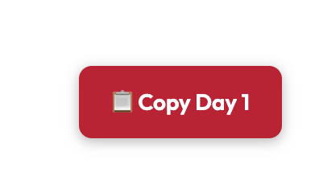
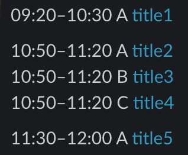
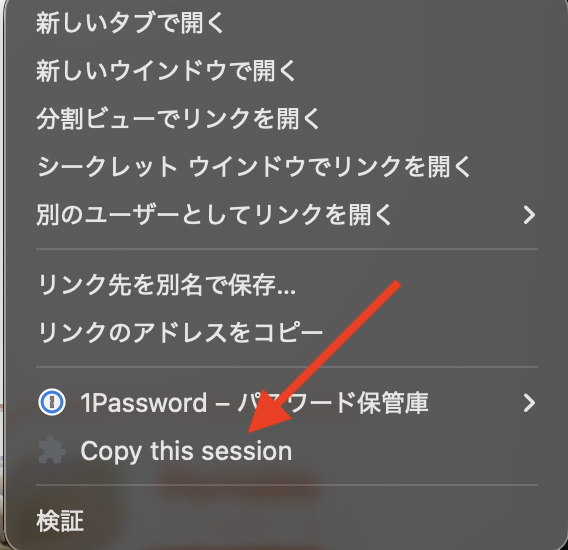
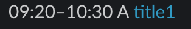

## Installation

Download the latest version from the releases page:  
https://github.com/otsuboa/rk-schedule-copy/releases

Then load the directory in `chrome://extensions/` (developer mode)

## Usage

### Copy the entire schedule using the button ("📋 Copy Day1")

then paste it into Slack

### Copy an individual session from the right-click menu ("Copy this session")

then paste it into Slack

